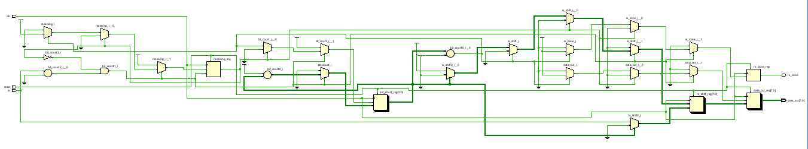
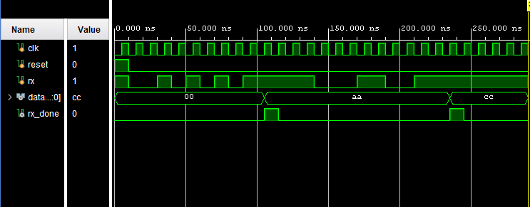

# RTL Design and Simulation of UART Receiver Using Verilog HDL

This project implements a **UART (Universal Asynchronous Receiver Transmitter) Receiver** using Verilog HDL. The receiver accepts serial UART data, detects the start bit, receives the incoming data bits, reconstructs the original 8-bit parallel data, and generates a completion signal after successful reception.

The design was developed and simulated using **Xilinx Vivado**.

---

## Features

* UART Serial Data Reception
* Start Bit Detection
* 8-bit Serial-to-Parallel Conversion
* Reception Complete Indication (`rx_done`)
* RTL Design and Verification
* Behavioral Simulation
* Verilog HDL Implementation

---

# UART Frame Format

The UART Receiver expects incoming frames in the following format:

```text
| Start Bit | Data Bits (8) | Stop Bit |
|     0     |   D0 ... D7   |     1    |
```

Data bits are received **LSB (Least Significant Bit) first**.

Example UART Frame:

```text
Data = 10101010

Received Frame:

0 0 1 0 1 0 1 0 1 1
↑                 ↑
Start           Stop
```

---

# Project Outputs

## RTL Schematic

The RTL schematic generated in Xilinx Vivado illustrates the internal architecture of the UART Receiver.



---

## RTL Schematic Analysis

### Input Signals

* `clk` : System clock
* `reset` : Initializes the receiver
* `rx` : UART serial input

### Control Logic

The control logic continuously monitors the serial input line and detects the start bit indicating the beginning of a UART frame.

### Bit Counter

The bit counter keeps track of the number of received bits and determines when a complete frame has been received.

### Shift Register

Incoming serial data bits are shifted into an internal register. After receiving all eight bits, the data is reconstructed into parallel format.

### Output Register

The received byte is stored in:

```text
data_out[7:0]
```

### Reception Complete Signal

```text
rx_done
```

is asserted when a complete UART frame has been successfully received.

---

# Verilog Code

## uart_rx.v

```verilog
module uart_rx(
    input clk,
    input reset,
    input rx,
    output reg [7:0] data_out,
    output reg rx_done
);

reg [3:0] bit_count;
reg [7:0] rx_shift;
reg receiving;

always @(posedge clk or posedge reset)
begin
    if(reset)
    begin
        bit_count <= 0;
        rx_shift <= 8'b0;
        data_out <= 8'b0;
        rx_done <= 0;
        receiving <= 0;
    end
    else
    begin
        rx_done <= 0;

        if(!receiving && rx == 0)
        begin
            receiving <= 1;
            bit_count <= 0;
        end
        else if(receiving)
        begin
            if(bit_count < 8)
            begin
                rx_shift[bit_count] <= rx;
                bit_count <= bit_count + 1;
            end
            else
            begin
                data_out <= rx_shift;
                rx_done <= 1;
                receiving <= 0;
            end
        end
    end
end

endmodule
```

---

# Testbench

## uart_rx_tb.v

```verilog
`timescale 1ns / 1ps

module uart_rx_tb;

reg clk;
reg reset;
reg rx;

wire [7:0] data_out;
wire rx_done;

uart_rx uut(
    .clk(clk),
    .reset(reset),
    .rx(rx),
    .data_out(data_out),
    .rx_done(rx_done)
);

always #5 clk = ~clk;

initial
begin
    clk = 0;
    reset = 1;
    rx = 1;

    #10;
    reset = 0;

    //------------------------------------
    // Receive AA
    //------------------------------------

    rx = 0; #10;

    rx = 0; #10;
    rx = 1; #10;
    rx = 0; #10;
    rx = 1; #10;
    rx = 0; #10;
    rx = 1; #10;
    rx = 0; #10;
    rx = 1; #10;

    rx = 1; #10;

    #30;

    //------------------------------------
    // Receive CC
    //------------------------------------

    rx = 0; #10;

    rx = 0; #10;
    rx = 0; #10;
    rx = 1; #10;
    rx = 1; #10;
    rx = 0; #10;
    rx = 0; #10;
    rx = 1; #10;
    rx = 1; #10;

    rx = 1; #10;

    #50;

    $finish;
end

endmodule
```

---

# Simulation Waveform

The simulation waveform verifies successful UART reception for multiple input frames.



---

# Waveform Analysis

The UART Receiver successfully reconstructs the transmitted serial data and converts it into parallel format.

---

## Initial State

After reset:

```text
data_out = 00
rx_done = 0
```

The receiver remains idle while monitoring the serial input line.

---

## First Reception

Input Data:

```text
AA (Hex)
```

Binary:

```text
10101010
```

Operation:

* Start bit detected
* 8 serial bits received
* Data reconstructed
* Output updated

Result:

```text
data_out = AA
rx_done = 1
```

---

## Second Reception

Input Data:

```text
CC (Hex)
```

Binary:

```text
11001100
```

Operation:

* Start bit detected
* Data bits received serially
* Parallel data reconstructed
* Reception completion indicated

Result:

```text
data_out = CC
rx_done = 1
```

---

# Applications

UART Receivers are widely used in:

* FPGA Development Boards
* Embedded Systems
* Microcontroller Communication
* Arduino and ESP32 Projects
* Raspberry Pi Interfaces
* Industrial Automation Systems
* Serial Debugging Applications
* Communication Protocol Testing

---

# Learning Outcomes

This project demonstrates:

* UART Communication Protocol
* Serial Data Reception
* Shift Register Operations
* Sequential Logic Design
* RTL Design Methodology
* Verilog HDL Coding
* Functional Verification
* Digital Communication Fundamentals

---

# Advantages of UART Communication

* Simple Hardware Implementation
* Low Cost Communication
* Reliable Serial Data Transfer
* Widely Supported Across Platforms
* Easy Integration with Embedded Systems

---

# Conclusion

This project successfully implements a UART Receiver using Verilog HDL. The receiver detects UART frames, receives serial data, reconstructs the original parallel data, and generates a reception completion signal. RTL schematic analysis and simulation results confirm the correct operation of the design for multiple UART data frames.

---

## Repository Structure

```text
UART-Receiver/
│
├── uart_rx.v
├── uart_rx_tb.v
├── schematic.png
├── waveform.png
└── README.md
```

---

## Author

**Farhana N S**

Electronics Engineering Student

Verilog HDL | FPGA Design | Digital Electronics | VLSI Enthusiast
